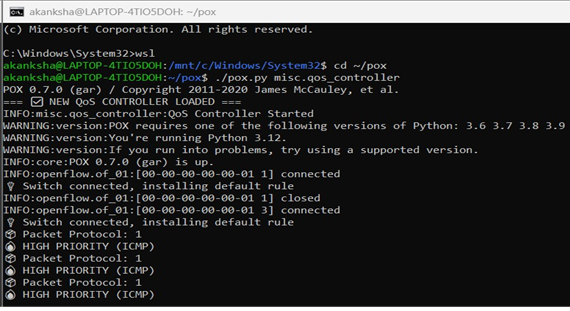
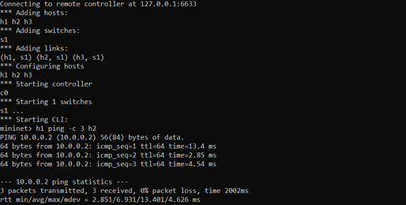
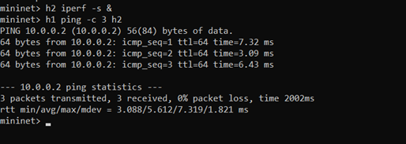

 Simple QoS Priority Controller using SDN (POX + Mininet)
 Problem Statement
In a network, not all traffic is equally important. Some traffic (like ping/ICMP) is latency-sensitive, while others (like file transfer/TCP) can tolerate delay.
This project implements a simple SDN-based QoS controller that:
•	Identifies different types of traffic
•	Assigns priorities to them
•	Controls how packets are handled using OpenFlow rules
________________________________________
 Objective
•	To design a controller that prioritizes ICMP traffic over TCP traffic
•	To demonstrate traffic classification and priority handling using SDN
•	To observe network behavior using Mininet
________________________________________
 Technologies Used
•	Mininet (Network Emulator)
•	POX Controller (SDN Controller)
•	OpenFlow Protocol
•	Ubuntu (WSL)
________________________________________
Network Topology
•	Single switch topology
•	3 hosts (h1, h2, h3)
•	All hosts connected to one switch
________________________________________
How to Run the Project
Step 1: Start Controller
cd ~/pox
./pox.py misc.qos_controller
________________________________________
Step 2: Start Mininet
(Open a new terminal)
sudo mn -c
sudo mn --topo single,3 --controller remote
________________________________________
Test Cases
Test Case 1: High Priority (ICMP)
h1 ping -c 3 h2
•	Protocol: ICMP
•	Priority: High
•	Observation: Faster response
________________________________________
Test Case 2: Low Priority (TCP)
h2 iperf -s &
h1 iperf -c h2
•	Protocol: TCP
•	Priority: Low
•	Observation: Compared to ICMP, treated with lower priority
________________________________________
Working Principle
•	The controller listens for PacketIn events
•	It checks the protocol of incoming packets:
o	ICMP → High Priority
o	TCP → Low Priority
•	Based on the type, it processes and forwards packets accordingly
________________________________________
Results
•	ICMP traffic is identified and given higher priority
•	TCP traffic is identified and given lower priority
•	Controller logs clearly show classification and behavior
________________________________________
Conclusion
This project demonstrates how SDN can be used to implement Quality of Service (QoS) by dynamically identifying traffic types and assigning priorities using a centralized controller.
________________________________________
Proof of Execution
 

Controller logs (HIGH & LOW priority)

Mininet ping output

iperf results
________________________________________
References
•	POX Controller Documentation
•	Mininet Official Guide
•	OpenFlow Basics

